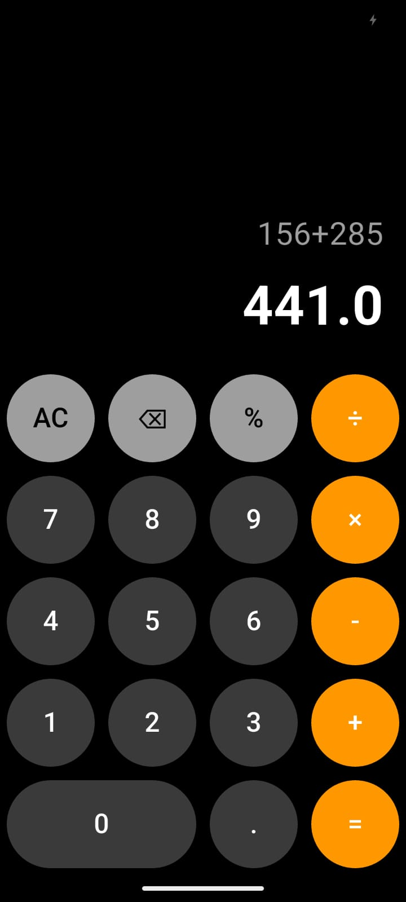

# 🧮 Calculator App (Flutter)

A simple and clean calculator application built using **Flutter**.  
This app supports basic arithmetic operations with real-time expression evaluation.

---

## ✨ Features

- ➕ Addition
- ➖ Subtraction
- ✖️ Multiplication
- ➗ Division
- 🔢 Decimal calculations
- 🧹 Clear (AC) functionality
- 🧠 Expression evaluation using `math_expressions`
- 📱 Clean UI inspired by modern mobile calculators

---

## 📸 Screenshots

### Expression Evaluation
**Example:** `5.2 + 5 = 10.2`

> More screenshots can be added here to show different states of the app.

---

## 🛠 Tech Stack

- **Flutter**
- **Dart**
- **math_expressions** package

---

